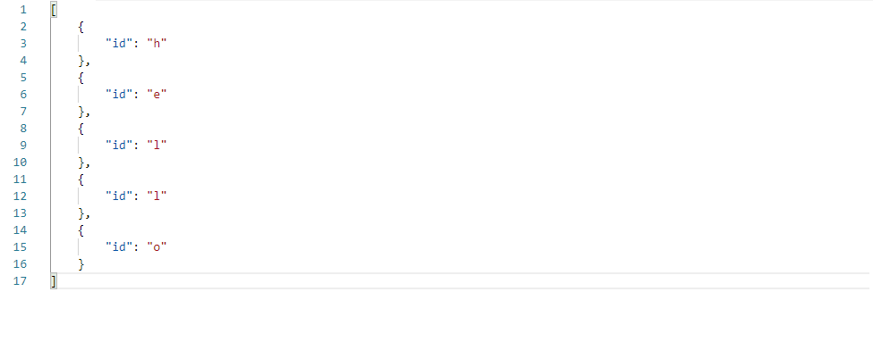

# js-this!



### Installation
```
npm install -g js-this
```
Then run 
```
js-this
```

### Usage
1. Copy text (or just select it in Linux)
2. Ctrl+Shift+J (Cmd+Shift+J in macOS)
3. Manipulate using JS code
4. Ctrl+Enter
5. Paste (no need to paste in Linux)